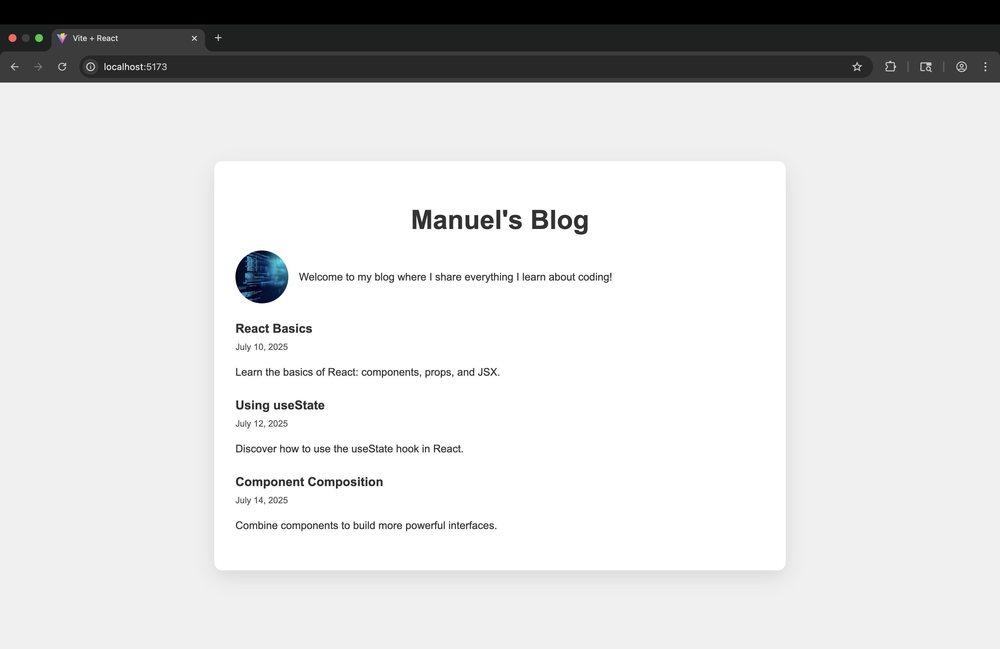

# My Blog

A simple React blog application showcasing posts, an about section, and a header.

---

## Running the Project

1. Clone the repository:

   ```bash
   git clone https://github.com/yourusername/my-blog.git
   cd my-blog
2. Install dependencies:
npm install
3. Run the development server:
npm run dev
4. Open your browser and navigate to:
http://localhost:3000

Testing
Run the test suite with:
npm test

## Screenshots

### Home Page



src/components - React components (Header, About, ArticleList, etc.)
src/blogData.js - Blog posts data
src/assets - Images and assets used in the blog

// Notes
The blog logo image is displayed only if provided.
ArticleList dynamically renders all blog posts from data.
Tests use Jest and React Testing Library for UI testing.

Contributing:
Feel free to open issues or submit pull requests for improvements!

License
This project is licensed under the MIT License.